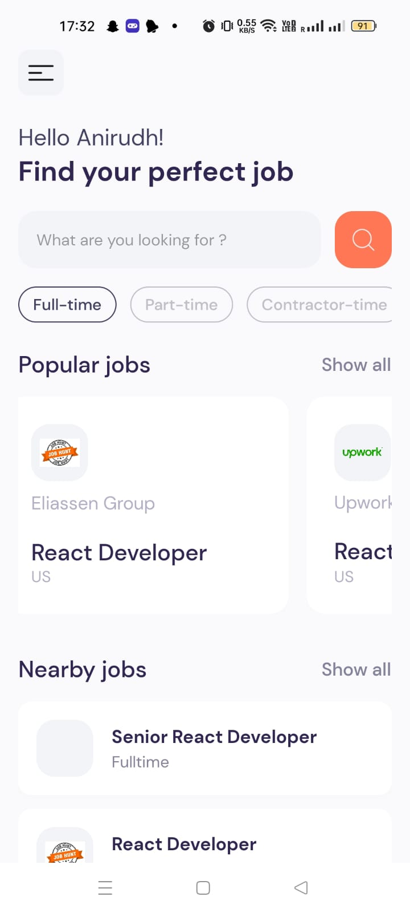
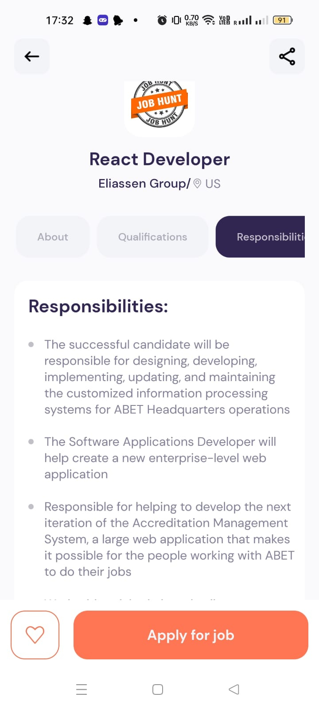
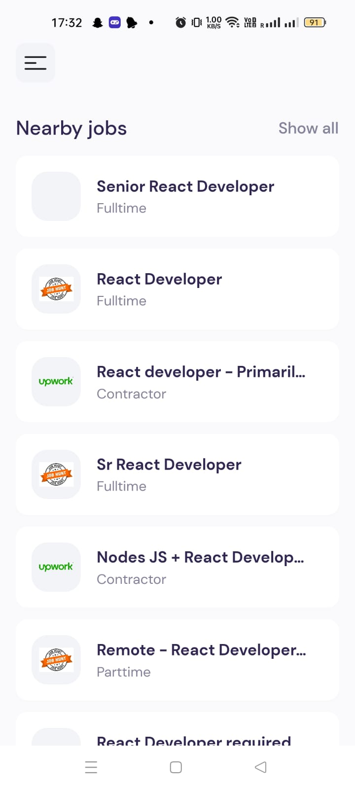

# Jobbify Mobile App

This app allows the user to look after available jobs which are fetched from different platforms by the help of JSearch API

Download expo go app on your mobile, and go to this link [jobbify](https://expo.dev/@aniruddhabajpai/react-native-jobs?serviceType=classic&distribution=expo-go) and scan the QR code to run the application

## Home

## JOB DETAILS PAGE

## Home > Job Listing Section

